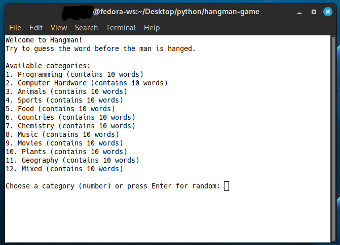
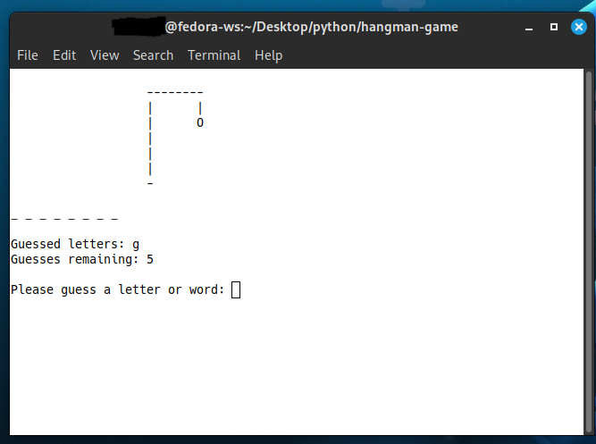

# Terminal-Based Hangman Game in Python

 *(running game)*  



## Description

A classic Hangman game implemented in Python that runs in the terminal. Players guess letters to uncover a hidden word before running out of attempts. Features include:

- External JSON word list with categories
- Detailed guess feedback
- Paced gameplay with message pauses
- ASCII art hangman visualization
- Category selection system

## Features

✔️ Configurable word lists via JSON  
✔️ Multiple difficulty levels (by word length)  
✔️ Guess tracking and attempt counting  
✔️ Clear terminal interface  
✔️ Play again option  
✔️ Category hints system  

## Installation

1. Clone the repository:
```bash
git clone https://github.com/yourusername/python-hangman.git
cd python-hangman
```

2. Ensure you have Python 3.6+ installed

3. Run the game:
```bash
python hangman.py
```

## Word List Configuration

Edit `words.json` to customize words and categories:
```json
{
    "words": ["default", "words"],
    "categories": {
        "programming": ["python", "algorithm"],
        "animals": ["giraffe", "elephant"]
    }
}
```

## How to Play

1. Choose a category (or play random)
2. Guess letters one at a time
3. You get 6 incorrect attempts
4. Win by guessing all letters before attempts run out

Example:
```
Guess: a
Good! 'a' appears 2 times in the word.
```

## Customization Options

Modify these variables in the code:
- `MAX_ATTEMPTS` - Change number of allowed mistakes
- `PAUSE_DURATION` - Adjust message display time
- Hangman ASCII art in `display_hangman()`

## Requirements

- Python 3.6+
- No external dependencies

## Future Improvements

✔️ Configurable word lists via JSON  
✔️ Multiple difficulty levels (by word length)  
✔️ Guess tracking and attempt counting  
✔️ Clear terminal interface  
✔️ Play again option  
✔️ Category hints system  

## Contributing

Pull requests welcome! For major changes, please open an issue first.

## License

[MIT](LICENSE) License
